# Campus Recruitment Recommendation System - 校园招聘推荐系统 | Campus Job Matching Platform

[](https://github.com/however-yir/campus-recruitment-recommendation-system/actions/workflows/ci.yml)

🔥 A campus recruitment recommendation system based on Spring Boot, Vue2, and MySQL.  
🚀 Built with user-based collaborative filtering, cold-start fallback, and multi-role recruitment workflows.  
⭐ Supports job matching, resume delivery, enterprise management, admin operations, and AI career Q&A.

<p align="center">
  面向高校求职场景的校园招聘推荐系统（学生端 / 企业端 / 管理端）
</p>

## 项目主周期（Main Timeline）

- `main 日期`：`2025.01 - 2025.06`
- `推进次数`：约 `30` 次（长周期迭代）

<p align="center">
  
  
  
  
  
</p>

---

## 目录

- [1. 项目概述](#1-项目概述)
- [2. 背景与问题定义](#2-背景与问题定义)
- [3. 建设目标与设计原则](#3-建设目标与设计原则)
- [4. 功能全景（按角色）](#4-功能全景按角色)
- [5. 核心业务流程](#5-核心业务流程)
- [6. 推荐系统设计与实现](#6-推荐系统设计与实现)
- [7. 技术架构与分层说明](#7-技术架构与分层说明)
- [8. 数据库设计摘要](#8-数据库设计摘要)
- [9. 项目结构](#9-项目结构)
- [10. 快速开始](#10-快速开始)
- [11. 配置说明](#11-配置说明)
- [12. 测试与质量保障](#12-测试与质量保障)
- [13. 截图与演示](#13-截图与演示)
- [14. 已知问题与优化方向](#14-已知问题与优化方向)
- [项目设计补充](#项目设计补充)
- [15. 免责声明](#15-免责声明)
- [16. License](#16-license)

---

## 1. 项目概述

本项目是一个围绕校园招聘场景构建的推荐系统，目标是连接求职学生、招聘企业与平台管理者，提供从“信息发布、岗位浏览、简历投递、互动交流、录用反馈”到“后台审核治理”的完整闭环能力。

系统采用 B/S 架构，后端基于 `Spring Boot` 构建 API 服务，前端采用 `Vue2 + Element UI` 分别实现用户端与管理端，数据层使用 `MySQL` 持久化存储。项目不仅实现了校园招聘平台的基础业务，还重点实现了“冷启动热门推荐 + 协同过滤推荐 + 交互排序反馈”的岗位推荐链路，以提高岗位匹配效率和用户求职体验。

近期工程加固已同步到主干代码：

- 密码重置接口已收紧为“登录管理员可执行”，不再允许匿名直接重置账号密码。
- 用户、企业、管理员资料修改改为白名单字段更新，避免整对象覆盖导致的误清空与越权改动。
- 学生与企业主键回归数据库自增，避免时间戳手工赋值带来的并发冲突。
- 协同过滤推荐改为按相似度加权累计得分，并在推荐不足时回退到热门岗位兜底。
- 新增 `AI 智能求职问答` 页面与后端接口，支持对接 OpenAI 兼容模型 API（如 SiliconFlow）。

该仓库当前为“可运行 + 可学习 + 可二开”的工程形态，适合作为：

- 校园招聘类系统课程设计/毕业设计参考
- Spring Boot + Vue2 全栈项目实践样例
- 推荐系统工程化落地的入门模板

---

## 2. 背景与问题定义

在传统校园招聘模式中，常见痛点包括：

1. 信息分散：学生需要在多个渠道反复检索岗位，时间成本高。
2. 匹配低效：岗位数量大，但“适合个人能力与意向”的岗位筛选困难。
3. 企业筛选压力大：简历处理与筛选流程冗长，招聘效率受限。
4. 招聘流程缺乏统一平台：宣讲、投递、反馈、互动等环节割裂。
5. 互动与反馈不足：学生与企业之间缺少顺畅、持续的信息交流机制。

本系统面向上述问题，提供统一平台能力，并通过推荐机制提升“岗位发现效率”和“信息触达准确度”。

---

## 3. 建设目标与设计原则

### 3.1 建设目标

- 构建一套覆盖学生、企业、管理员三端的校园招聘服务平台。
- 支持岗位、宣讲、简历、求职记录、录用结果、论坛、留言等核心业务。
- 通过推荐算法降低信息不对称，提高岗位匹配效率与求职成功率。
- 保障系统具备可维护性、可扩展性与可部署性。

### 3.2 设计原则

- 业务完整：覆盖“发布-浏览-投递-审核-反馈-复盘”主流程。
- 分层清晰：视图层、网络层、业务层、数据层职责明确。
- 体验优先：前端交互尽量简洁直接，减少用户操作成本。
- 推荐可落地：先解决可用性，再逐步提升算法复杂度和效果。
- 安全可控：提供基础审核、鉴权与管理治理能力。

---

## 4. 功能全景（按角色）

### 4.1 学生用户端

- 账号注册、登录、身份会话
- 个人中心维护（个人资料与头像等）
- 企业宣讲浏览与检索
- 招聘信息浏览、筛选、详情查看
- 岗位收藏与推荐列表交互排序
- 求职信息提交（应聘行为记录）
- 求职简历维护与投递
- 招聘结果查看
- AI 智能求职问答（大模型 API 调用）
- 论坛发帖/回帖互动
- 留言反馈提交

### 4.2 企业端

- 企业账号注册与登录
- 企业资料维护（基础信息、封面、简介等）
- 企业宣讲内容发布与管理
- 招聘岗位发布、更新、下架与审核跟踪
- 求职信息查看与处理
- 简历查看与招聘结果管理
- 面试邀请相关信息维护

### 4.3 管理员端

- 用户信息审核与管理
- 企业资质审核与信息治理
- 岗位分类与招聘信息管理
- 求职信息与简历审核
- 论坛分类、帖子、举报记录管理
- 留言反馈处理与回复
- 系统配置管理（轮播、基础参数等）

### 4.4 能力矩阵（简版）

| 模块 | 学生 | 企业 | 管理员 |
|---|---|---|---|
| 账号体系 | 注册/登录 | 注册/登录 | 登录 |
| 岗位信息 | 浏览/收藏/应聘 | 发布/维护 | 审核/管理 |
| 宣讲信息 | 浏览 | 发布/维护 | 管理 |
| 简历与求职 | 新增/修改/查看结果 | 查看/处理 | 审核 |
| 社区互动 | 发帖/回帖/留言 | 参与互动 | 分类/举报/内容治理 |
| 系统配置 | - | - | 配置管理 |

---

## 5. 核心业务流程

### 5.1 注册与登录流程

用户首次访问可浏览公开内容；执行收藏、投递、发帖等操作前需注册并登录。登录后系统根据角色加载对应菜单和权限。

### 5.2 岗位浏览与应聘流程

学生在招聘列表按关键词、分类等条件检索岗位，进入详情后可收藏或投递。投递后进入企业处理队列，并可在后续查看招聘结果。

### 5.3 企业招聘运营流程

企业维护企业资料后可发布宣讲与招聘信息，持续更新岗位要求；系统支持企业查看投递记录、筛选候选人并维护招聘结果。

### 5.4 管理治理流程

管理员在后台对用户、企业、岗位、论坛内容及举报信息进行审核与处理，保证平台内容质量与业务流程合规。

### 5.5 互动反馈流程

平台提供论坛与留言反馈模块，帮助学生、企业、平台之间建立持续沟通渠道，形成“问题发现-反馈-处理-再反馈”的闭环。

---

## 6. 推荐系统设计与实现

推荐模块是本项目的核心亮点之一，采用分层策略，兼顾冷启动可用性与个性化效果。

### 6.1 总体策略

系统将推荐拆分为四个阶段：

1. 冷启动热门推荐
2. 协同过滤个性化推荐
3. 类别偏好重排
4. 前端交互排序反馈

这样设计的原因是：新用户没有行为数据，先用热门兜底；老用户逐步转向个性化；同时保留可解释、可交互的排序反馈。

### 6.2 冷启动热门推荐

当系统检测到用户没有收藏记录，或协同过滤结果不足以填满推荐位时，系统会回退到热门岗位兜底。热门排序优先参考岗位收藏热度 `storeupnum`，并结合最近点击时间 `clicktime` 做次级排序，保证新用户一进入系统就能看到平台内相对热门的岗位。

### 6.3 协同过滤推荐

当用户存在收藏行为后，系统走 `/zhaopinxinxi/autoSort2`：

- 从收藏记录中构建“用户-岗位”稀疏评分矩阵
- 采用余弦相似度计算目标用户与其他用户的相似度
- 将“邻域用户数量 K”与“最终返回结果数 N”拆分处理，避免推荐数量和相似用户数量强绑定
- 对目标用户尚未收藏的候选岗位按“相似度 × 收藏强度”累加打分，而不是简单覆盖最后一位用户的分值
- 推荐不足时，再从热门岗位池补齐，避免结果集过短

对应实现可参考：

- `src/main/java/com/utils/UserBasedCollaborativeFiltering.java`
- `src/main/java/com/controller/ZhaopinxinxiController.java`

### 6.4 类别偏好重排

在协同过滤得到候选集合后，系统会结合用户历史收藏中的“职位类别偏好”再次重排，使推荐结果更贴近当前用户关注方向。

### 6.5 交互排序反馈

前端支持收藏按钮与升降序箭头。用户收藏后，系统同步更新收藏记录与热度字段；用户可在同类列表内切换 `ASC / DESC` 查看不同热度排序，形成即时反馈。

### 6.6 推荐链路价值

- 对新用户：保证“有内容可看”。
- 对活跃用户：保证“内容更懂我”。
- 对整体平台：平衡曝光效率与个体匹配精度。

---

## 7. 技术架构与分层说明

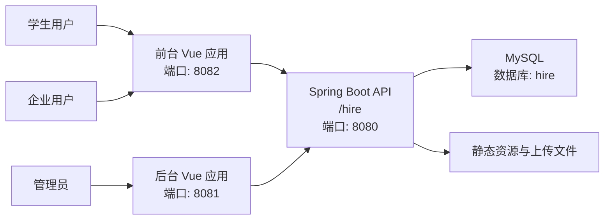

### 7.1 前端层

- 学生端：`src/main/resources/front/front`
- 管理端：`src/main/resources/admin/admin`
- 技术栈：Vue2、Element UI、Vue Router、Vuex

### 7.2 接口与业务层

后端采用 Controller -> Service -> DAO 的典型分层结构，具备良好的可维护性：

- Controller：接收请求与参数校验
- Service：业务逻辑处理
- DAO + Mapper：数据访问与 SQL 映射

### 7.3 数据层

使用 MySQL 存储核心业务数据，关键表覆盖用户、企业、岗位、求职、简历、招聘结果、论坛与留言等完整业务域。

---

## 8. 数据库设计摘要

系统数据库名默认为 `hire`，初始化脚本位于 `db/hire.sql`。以下为关键业务表摘要：

| 表名 | 说明 |
|---|---|
| `yonghu` | 学生用户信息 |
| `qiyexinxi` | 企业信息 |
| `zhaopinxinxi` | 招聘岗位信息（含热度字段） |
| `qiuzhixinxi` | 求职投递记录 |
| `qiuzhijianli` | 求职简历 |
| `zhaopinjieguo` | 招聘结果 |
| `qiyexuanjiang` | 企业宣讲 |
| `forum` / `forumtype` | 论坛与分类 |
| `forumreport` | 论坛举报 |
| `messages` | 留言反馈 |
| `storeup` | 收藏记录（推荐重要输入） |
| `config` | 系统配置 |

其中，推荐逻辑重点依赖：

- `storeup`：用户收藏行为数据
- `zhaopinxinxi.storeupnum`：岗位热度指标
- `zhaopinxinxi.clicktime`：点击时间相关排序参考

---

## 9. 项目结构

```text
campus-recruitment-recommendation-system/
├── db/
│   └── hire.sql
├── src/main/java/com/
│   ├── controller/                      # 控制器
│   ├── service/                         # 业务服务
│   ├── dao/                             # 数据访问
│   ├── entity/                          # 实体/VO/Model/View
│   ├── config/                          # 配置
│   ├── interceptor/                     # 拦截器
│   └── utils/                           # 工具类（含推荐算法）
├── src/main/resources/
│   ├── application.yml                  # 后端配置
│   ├── mapper/                          # MyBatis XML
│   ├── static/upload/                   # 上传资源
│   ├── front/front/                     # 前台工程
│   └── admin/admin/                     # 后台工程
└── pom.xml
```

---

## 10. 快速开始

### 10.1 环境要求

- JDK 1.8
- Maven 3.6+
- Node.js 14+
- MySQL 5.7+

### 10.2 克隆代码

```bash
git clone https://github.com/however-yir/campus-recruitment-recommendation-system.git
cd campus-recruitment-recommendation-system
```

### 10.3 推荐启动顺序

建议按固定顺序启动，避免前端接口 404 或数据库连接失败：

1. 启动依赖服务（MySQL / Redis）
2. 初始化数据库
3. 启动后端
4. 启动前台（学生/企业）
5. 启动后台（管理员）

### 10.4 启动依赖服务（可选）

```bash
cp .env.example .env.local
docker compose -f docker-compose.dev.yml up -d
```

### 10.5 初始化数据库

```bash
mysql -uroot -p < db/hire.sql
```

### 10.6 配置后端

编辑 `src/main/resources/application.yml`：

- `spring.datasource.url`
- `spring.datasource.username`
- `spring.datasource.password`

默认配置：

- 端口：`8080`
- 上下文路径：`/hire`

### 10.7 启动后端

```bash
mvn clean package
mvn spring-boot:run
```

如需自动加载 `.env.local`（含数据库与 AI 变量），可使用：

```bash
./scripts/run-dev-with-env.sh
```

### 10.8 启动前台（学生/企业访问）

```bash
cd src/main/resources/front/front
npm ci
npm run serve
```

访问地址：`http://localhost:8082`

### 10.9 启动后台（管理员）

```bash
cd src/main/resources/admin/admin
npm ci
npm run serve
```

访问地址：`http://localhost:8081`

### 10.10 生产构建（可选）

```bash
# 前台
cd src/main/resources/front/front
npm run build

# 后台
cd src/main/resources/admin/admin
npm run build
```

### 10.11 启用 AI 智能求职问答（SiliconFlow 示例）

在项目根目录创建或修改 `.env.local`（该文件已被 `.gitignore` 忽略）：

```bash
AI_ASSISTANT_ENABLED=true
AI_ASSISTANT_API_URL=https://api.siliconflow.cn/v1/chat/completions
AI_ASSISTANT_API_KEY=your_key
AI_ASSISTANT_AUTH_HEADER=Authorization
AI_ASSISTANT_AUTH_SCHEME=Bearer
AI_ASSISTANT_MODEL=Pro/deepseek-ai/DeepSeek-V3.2
AI_ASSISTANT_TIMEOUT_MS=120000
AI_ASSISTANT_SYSTEM_PROMPT=你是一个有用的助手
```

启动后访问：

- 前台页面：`/front/dist/index.html#/index/aiCareerChat`
- 后端接口：`POST /hire/ai/career/ask`

---

## 11. 配置说明

### 11.1 后端配置

文件：`src/main/resources/application.yml`

- 服务端口与 context-path
- MySQL 连接信息
- MyBatis-Plus 映射路径
- 文件上传大小限制
- AI 求职问答配置（OpenAI 兼容 API）

### 11.2 前台配置

文件：`src/main/resources/front/front/src/config/config.js`

关键项：

- `baseUrl: 'http://localhost:8080/hire/'`
- `name: '/hire'`
- `indexNav` 中已新增 `AI求职问答` 菜单项（`/index/aiCareerChat`）

### 11.3 后台配置

文件：`src/main/resources/admin/admin/src/utils/base.js`

关键项：

- `url: 'http://localhost:8080/hire/'`
- `indexUrl: 'http://localhost:8080/hire/front/dist/index.html'`

### 11.4 AI 求职问答关键配置项

文件：`src/main/resources/application.yml`

- `ai.assistant.enabled`
- `ai.assistant.api-url`
- `ai.assistant.api-key`
- `ai.assistant.auth-header`
- `ai.assistant.auth-scheme`（`Bearer` 或 `NONE`）
- `ai.assistant.model`
- `ai.assistant.timeout-ms`
- `ai.assistant.system-prompt`

### 11.5 安全相关环境变量（新增）

为避免密钥硬编码，以下配置建议通过环境变量注入：

- `BAIDU_APP_ID`
- `BAIDU_API_KEY`
- `BAIDU_SECRET_KEY`
- `BAIDU_ACCESS_KEY`
- `BAIDU_ACCESS_SECRET_KEY`
- `VUE_APP_AMAP_KEY`（前后台地图 SDK Key）

---

## 12. 测试与质量保障

项目测试策略采用“黑盒测试 + 白盒测试”结合方式：

### 12.1 黑盒测试重点

- 注册登录功能正确性
- 招聘信息查询、查看、收藏、评论流程
- 留言反馈提交与回复流程
- 论坛发帖回帖流程
- 管理端审核流程

### 12.2 白盒测试重点

- 推荐算法路径与边界条件
- 控制器参数处理与异常分支
- 核心业务方法的逻辑正确性
- 数据更新链路的一致性

### 12.3 结果摘要

根据论文中的测试用例执行结果，系统在注册登录、招聘信息管理、互动反馈与后台管理等核心模块上能够满足既定功能需求，整体流程可稳定运行；同时，推荐模块已实现可用级别的个性化能力，并保留了继续优化的空间。

---

## 13. 截图与演示

> 说明：本仓库已进行个人信息脱敏处理。下方将放置不含姓名/手机号等敏感信息的关键截图。

### 13.1 架构与设计图

#### 物理拓扑图

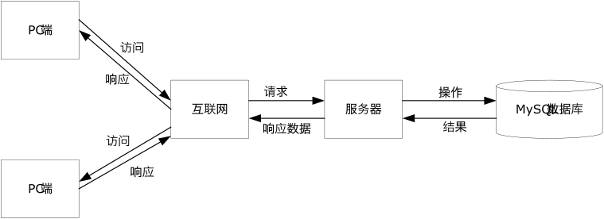

#### 系统结构功能图

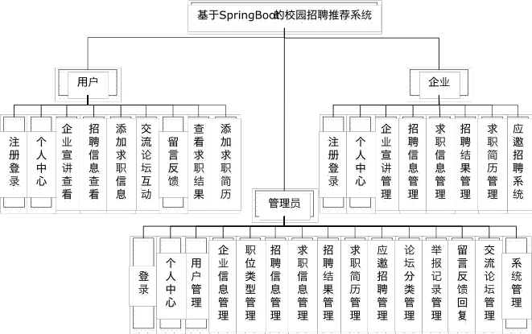

#### 总体 E-R 图

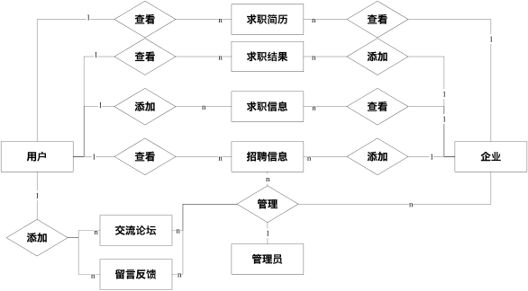

#### 企业信息实体属性图

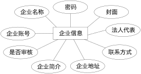

### 13.2 第五章系统实现界面图

#### 5.1 用户登录界面

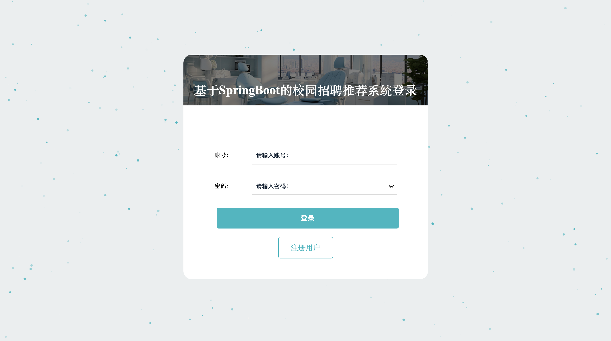

#### 5.1 用户注册界面

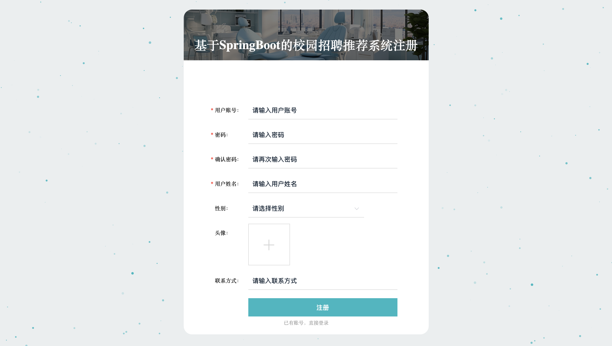

#### 5.1 招聘信息推荐区域

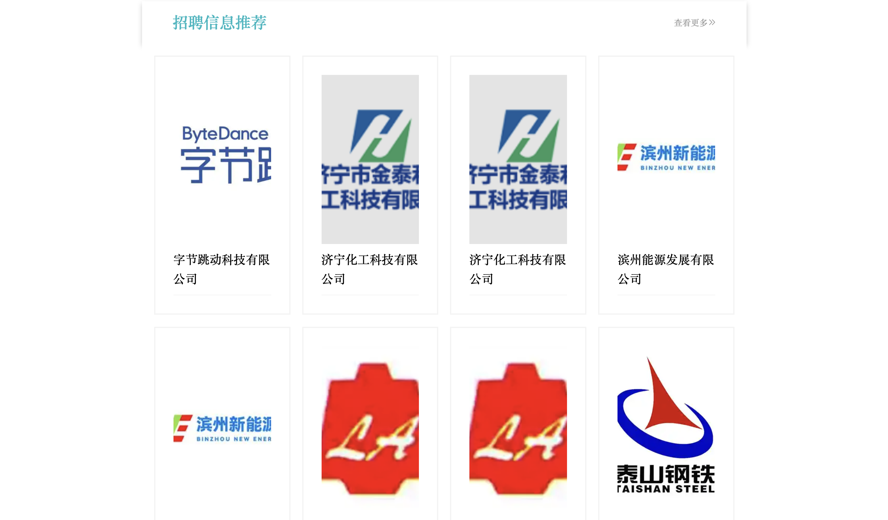

#### 5.1 企业宣讲展示区域

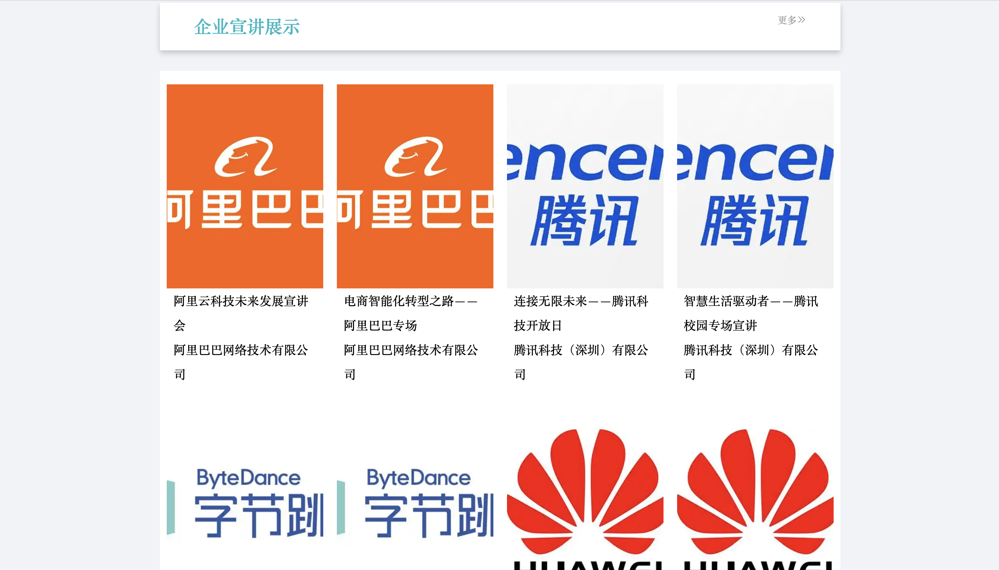

#### 5.2 后台登录界面

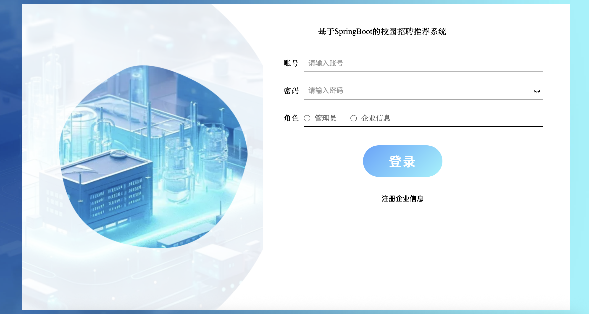

#### 5.2 后台招聘信息管理界面

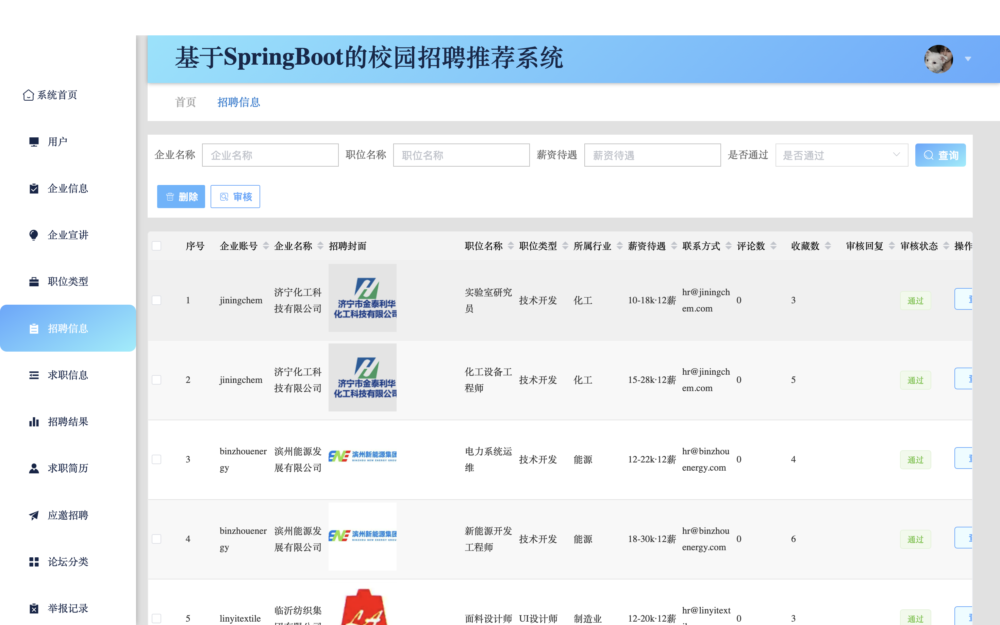

### 13.3 业务流程图补充

#### 用户注册登录流程图

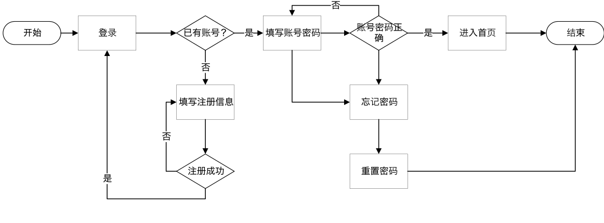

#### 添加求职信息流程图

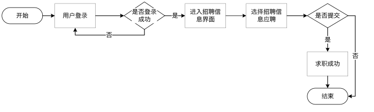

---

## 14. 已知问题与优化方向

### 14.1 当前可优化点

- 推荐算法仍以协同过滤为主，可继续引入更强的语义匹配与多特征融合。
- 测试自动化程度可进一步提升（单测、接口回归、CI）。
- 默认示例数据可进一步精简并增强脱敏。
- 部署文档可补充 Docker Compose 方案，降低上手成本。

### 14.2 后续路线图

- [ ] 引入用户画像与岗位语义特征融合推荐
- [ ] 增加推荐效果评估指标（Precision@K / Recall@K / CTR）
- [ ] 引入 Redis 缓存与热点查询优化
- [ ] 完善 CI/CD 流水线
- [ ] 完成容器化部署模板

---

## 项目设计补充

### 实现路径

项目整体按两条主线并行推进：

1. 先完成校园招聘平台的基础业务，包括学生、企业、管理员三端角色，招聘信息、宣讲、简历、投递、招聘结果、论坛和留言等模块；
2. 再在基础业务之上补推荐能力，先实现冷启动热门推荐，再做基于收藏行为的协同过滤推荐，最后补排序和兜底逻辑。

之所以这样设计，是因为推荐算法必须依赖已有业务数据；如果招聘平台本身不成立，推荐链路就缺少有效输入，也难以体现价值。

### 关键难点

项目的复杂点主要集中在三方面：

- 新用户缺少行为数据，冷启动阶段无法直接个性化推荐；
- 用户收藏数据相对稀疏，协同过滤容易出现结果偏少或稳定性不足；
- 推荐能力需要真正接入招聘业务流程，而不是孤立做成一个算法 Demo。

### 当前处理方式

当前实现采用了分层落地的方式：

- 冷启动阶段走 `/zhaopinxinxi/autoSort`，按岗位收藏热度 `storeupnum` 返回热门岗位，保证新用户进入系统后能获得基础推荐结果；
- 当用户存在收藏行为后，走 `/zhaopinxinxi/autoSort2`，从 `storeup` 收藏记录中构建用户-岗位评分矩阵，再通过 `UserBasedCollaborativeFiltering` 计算相似用户并生成推荐列表；
- 对推荐结果不足的情况，增加非推荐岗位兜底补齐，避免推荐列表为空；
- 推荐模块直接挂接在招聘信息业务链路中，使推荐结果成为岗位浏览过程的一部分。

### 后续优化方向

如果继续迭代，优先级较高的方向包括：

- 在协同过滤之外引入岗位语义特征和用户画像，提升推荐精度；
- 增加 `Precision@K`、`Recall@K`、点击率等推荐效果评估指标；
- 引入 Redis 缓存和热门数据加速，优化高频查询；
- 提升推荐链路可解释性，让前端能展示推荐依据；
- 增强测试和容器化部署，使系统更接近可上线状态。

---

## 15. 免责声明

本仓库用于学习交流与项目展示。文档已移除学校、姓名、学号、联系方式等个人敏感信息。

若用于二次开发或线上部署，建议优先完成：

1. 数据库账号与密钥替换
2. 默认测试数据脱敏/清理
3. 公开资源与上传目录合规审查
4. 日志与访问控制策略加固

---

## 16. License

MIT

## 简历改造清单

- 追踪文件：[docs/resume-upgrade-checklist.md](docs/resume-upgrade-checklist.md)
- 环境模板：[.env.example](.env.example)
- 开发 compose：[docker-compose.dev.yml](docker-compose.dev.yml)
- CI 配置：[.github/workflows/ci.yml](.github/workflows/ci.yml)
- 评估脚本：[scripts/evaluation/recommendation_metrics.py](scripts/evaluation/recommendation_metrics.py)

本轮已落地：推荐兜底与解释能力、配置外置化、评估脚本骨架与 CI 基线。
