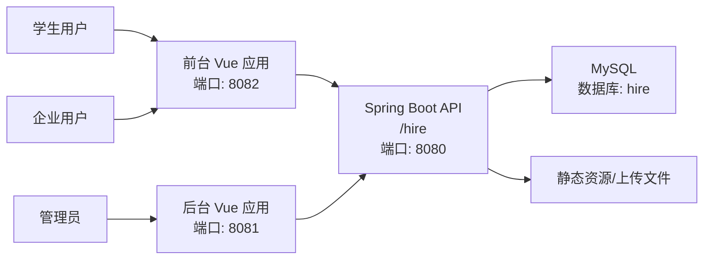

# Campus Recruitment Recommendation System

<p align="center">
  基于 `Spring Boot + Vue2 + MySQL` 的校园招聘推荐系统，提供学生端、企业端、管理端三类角色能力。
</p>

<p align="center">
  
  
  
  
  
</p>

## 目录

- [项目简介](#项目简介)
- [核心功能](#核心功能)
- [技术栈](#技术栈)
- [系统架构](#系统架构)
- [项目结构](#项目结构)
- [快速开始](#快速开始)
- [配置说明](#配置说明)
- [推荐机制说明](#推荐机制说明)
- [截图与演示](#截图与演示)
- [路线图](#路线图)
- [免责声明](#免责声明)
- [License](#license)

## 项目简介

本项目聚焦校园招聘场景，面向三类角色提供一体化能力：

- 学生用户：注册登录、浏览企业宣讲与岗位、发布求职信息、维护简历、查看招聘结果、论坛交流、留言反馈。
- 企业用户：发布与维护企业宣讲、招聘岗位、处理求职信息、跟进招聘流程。
- 管理员：用户与企业信息审核、招聘信息管理、论坛与举报管理、系统配置管理。

项目目标是提升招聘效率与匹配准确度，降低信息不对称问题，并通过社区互动提升用户参与度。

## 核心功能

### 1. 用户侧（前台）

- 账号注册、登录、个人中心
- 企业宣讲浏览与招聘信息检索
- 求职信息与简历管理
- 招聘结果查看
- 交流论坛（发帖、回帖、互动）
- 留言反馈

### 2. 企业侧

- 企业信息维护
- 宣讲信息发布与管理
- 招聘岗位发布与维护
- 简历及求职信息查看
- 招聘结果管理

### 3. 管理侧

- 用户管理、企业信息管理
- 岗位分类与招聘信息管理
- 求职信息与简历审核
- 论坛分类、帖子与举报记录管理
- 系统配置管理

## 技术栈

### 后端

- Java 8
- Spring Boot 2.2.2.RELEASE
- MyBatis-Plus
- Apache Shiro
- MySQL

### 前端

- Vue 2
- Vue Router / Vuex
- Element UI
- Axios

### 其他

- WebSocket（实时交互能力）
- Maven（后端构建）
- NPM（前端构建）

## 系统架构



## 项目结构

```text
xiaoyuan-zhaopin-system/
├── db/
│   └── hire.sql                         # 数据库初始化脚本
├── src/main/java/com/
│   ├── controller/                      # 接口层
│   ├── service/                         # 业务层
│   ├── dao/                             # 数据访问层
│   ├── entity/                          # 实体/VO/Model/View
│   ├── config/                          # 配置
│   └── utils/                           # 工具与推荐算法
├── src/main/resources/
│   ├── application.yml                  # 后端配置
│   ├── mapper/                          # MyBatis XML
│   ├── static/upload/                   # 上传与示例静态资源
│   ├── front/front/                     # 前台 Vue 项目
│   └── admin/admin/                     # 管理端 Vue 项目
└── pom.xml
```

## 快速开始

### 1. 环境准备

- JDK 1.8
- Maven 3.6+
- Node.js 14+（建议）
- MySQL 5.7+

### 2. 克隆项目

```bash
git clone https://github.com/however-yir/xiaoyuan-zhaopin-system.git
cd xiaoyuan-zhaopin-system
```

### 3. 初始化数据库

```bash
mysql -uroot -p < db/hire.sql
```

默认数据库名为 `hire`。

### 4. 配置后端

编辑 `src/main/resources/application.yml`，至少确认以下配置：

- `spring.datasource.url`
- `spring.datasource.username`
- `spring.datasource.password`

默认后端端口与上下文路径：

- 端口：`8080`
- 上下文：`/hire`

### 5. 启动后端

```bash
mvn clean package
mvn spring-boot:run
```

### 6. 启动前台（用户端）

```bash
cd src/main/resources/front/front
npm install
npm run serve
```

默认地址：`http://localhost:8082`

### 7. 启动后台（管理端）

```bash
cd src/main/resources/admin/admin
npm install
npm run serve
```

默认地址：`http://localhost:8081`

### 8. 访问说明

- 后端 API Base URL：`http://localhost:8080/hire/`
- 前台：`http://localhost:8082`
- 后台：`http://localhost:8081`

## 配置说明

### 前台配置

文件：`src/main/resources/front/front/src/config/config.js`

关键项：

- `baseUrl`: 后端地址（默认 `http://localhost:8080/hire/`）
- `name`: 项目标识（默认 `/hire`）

### 后台配置

文件：`src/main/resources/admin/admin/src/utils/base.js`

关键项：

- `url`: 后端地址（默认 `http://localhost:8080/hire/`）
- `indexUrl`: 前台打包后的入口地址

## 推荐机制说明

项目中包含用户协同过滤相关实现（`UserBasedCollaborativeFiltering`），用于招聘信息推荐。

可在此基础上进一步扩展：

- 用户画像特征工程（专业、技能、意向城市、薪资期望）
- 职位文本语义匹配（NLP）
- 行为数据驱动的实时推荐（点击、收藏、投递）

## 截图与演示

当前仓库 README 先提供文字版说明。后续将补充以下模块截图（已脱敏版本）：

- 前台首页与职位推荐
- 企业宣讲与职位详情
- 管理端数据看板与审核页面

## 路线图

- [ ] 补充脱敏后的系统截图
- [ ] 增加 Docker 一键部署脚本
- [ ] 增加单元测试与接口测试
- [ ] 推荐算法效果评估与可视化
- [ ] CI 自动化构建与质量检查

## 免责声明

本仓库用于学习、交流与毕业设计项目展示。README 已移除学校、姓名、学号、联系方式等个人敏感信息。

如果用于二次开发或部署，请先完成：

- 密钥与账号信息替换
- 默认账号与测试数据清理
- 静态资源与上传文件脱敏检查

## License

MIT
